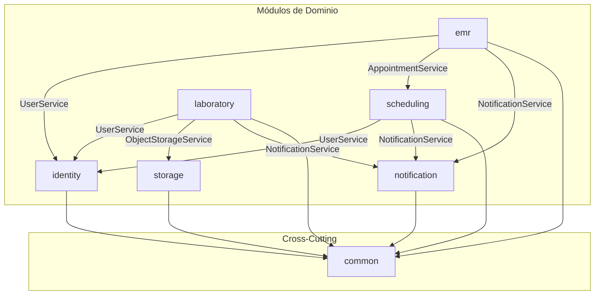

# Arquitectura General (Monolito Modular)

Este documento describe la estructura arquitectónica global de Ugram Health. 

## 1. Stack Tecnológico (100% Local / Self-Hosted)

*   **Lenguaje:** Java 21+ (LTS, virtual threads, pattern matching).
*   **Framework:** Spring Boot 3.4.x (Ecosistema maduro, Spring Security, Spring Data JPA).
*   **Contenedores:** Docker + Docker Compose para despliegue "One-Click".
*   **Almacenamiento de Archivos:** MinIO (S3-compatible) para Object Storage local.
*   **Autenticación:** JWT (HS512) via JJWT 0.12 (100% interno, sin dependencias externas como OAuth2/EntraID).
*   **Construcción y Dependencias:** Gradle 8.11 (Velocidad, Kotlin DSL).
*   **Mapeo de Datos:** MapStruct 1.6 (Generación en compile-time, zero reflection) y Lombok para reducir boilerplate.
*   **Generación de PDF:** OpenPDF 2.0 (Para reportes de laboratorio).

## 2. Estructura de Directorios del Código Fuente

El código se organiza bajo el patrón "Package-by-Feature" (Módulos por Dominio) dentro de `src/main/java/bo/edu/uagrm/ugram/`.

```
bo.edu.uagrm.ugram/
├── UgramHealthApplication.java  # Entry point
│
├── common/                      # Infraestructura transversal
│   ├── config/                  # Seguridad, MinIO, CORS
│   ├── security/                # JwtProvider, JwtAuthFilter
│   ├── exception/               # GlobalExceptionHandler
│   ├── dto/                     # ApiResponse, PagedResponse
│   └── util/                    # Utilidades de cifrado (HashUtil)
│
├── identity/                    # Dominio: Usuarios, Auth, RBAC
│   ├── controller/
│   ├── service/
│   ├── repository/
│   └── entity/                  # User, UserType
│
├── scheduling/                  # Dominio: Agendamiento, Kanban
│   ├── entity/                  # Appointment
│   └── repository/
│
├── emr/                         # Dominio: Historia Clínica
│   ├── entity/                  # ClinicalRecord, CorrectionNote
│   └── service/                 # BlockchainService (Interfaces)
│
├── laboratory/                  # Dominio: Laboratorio Central
│   └── entity/                  # LabOrder, LabCatalog
│
├── notification/                # Dominio: Notificaciones Push
│
└── storage/                     # Dominio: Almacenamiento (MinIO)
    └── service/                 # ObjectStorageService
```

## 3. Diagrama de Dependencias de Módulos

Los módulos tienen dependencias direccionales estrictas. **Regla de oro:** Un módulo NUNCA accede al `Repository` de otro módulo, siempre usa el `Service`.



## 4. Topología Docker Compose

La infraestructura actual configurada en `docker/docker-compose.yml`:

| Servicio | Imagen | Puerto Expuesto | Función |
|---|---|---|---|
| `postgres` | `postgres:16-alpine` | `5432` | Base de datos principal. |
| `minio` | `minio/minio:latest` | `9000` / `9001` | Almacenamiento de PDFs y DICOM. |
| `backend` | Custom (Dockerfile) | `8080` | Aplicación Spring Boot. |

*(Nota: En la Fase 4 se añadirán los servicios de Hyperledger Fabric).*
