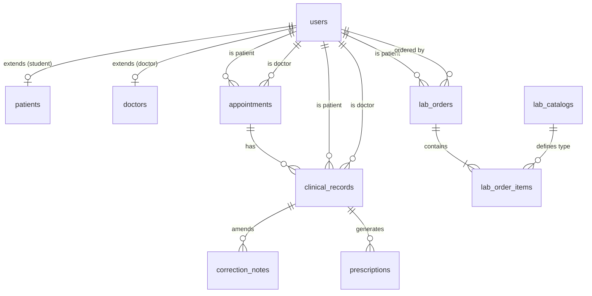

# Base de Datos y Esquema Relacional

Este documento detalla el esquema actual de PostgreSQL y la estrategia de migraciones.

## 1. Migraciones (Flyway)

Utilizamos Flyway para gestionar los esquemas. Las migraciones están en `src/main/resources/db/migration/`:

*   **V1__create_users_and_identity.sql**: Tablas `users`, `patients` (perfil extendido estudiantes), `doctors` (perfil extendido médicos). Define enums de roles.
*   **V2__create_appointments.sql**: Tabla `appointments`. Incluye constraint crucial: `CHECK (scheduled_end > scheduled_start)`.
*   **V3__create_clinical_records.sql**: Tablas del EMR (`clinical_records`, `correction_notes`, `prescriptions`, `snippets`).
*   **V4__create_lab_tables.sql**: Tablas del laboratorio (`lab_catalogs`, `lab_orders`, `lab_order_items`).
*   **V5__seed_initial_data.sql**: Datos de prueba (Admin, Doctores, Estudiantes, Laboratoristas, Catálogo de Lab, Snippets básicos).

## 2. Diagrama Entidad-Relación (ER)

## 3. Decisiones de Diseño en Base de Datos

*   **UUIDs como Primary Keys:** En lugar de enteros autoincrementales, todas las tablas usan `UUID` (`gen_random_uuid()`). Esto previene ataques de enumeración (IDOR) donde un atacante adivina el ID del siguiente registro.
*   **Inmutabilidad del EMR:** La tabla `clinical_records` no tiene columna `updated_at`. Por diseño de sistema, un registro médico no se edita en la tabla principal; cualquier corrección se inserta en la tabla de solo adición `correction_notes`.
*   **Extensiones de Postgres:** El script de inicialización de Docker activa `uuid-ossp` y `pgcrypto`.
